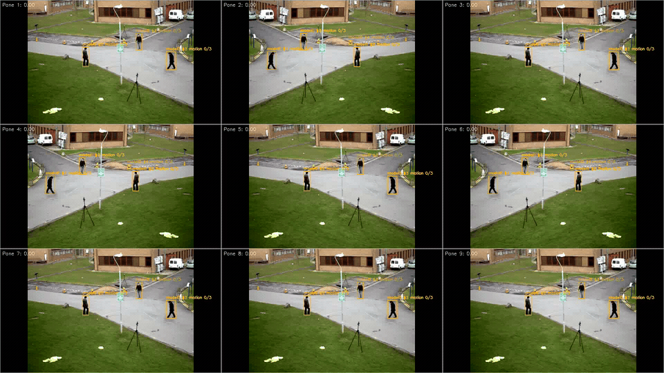
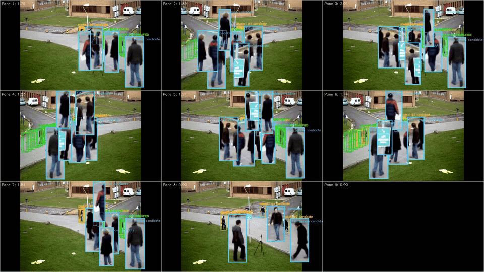

# 🔍 Compare
An Ensemble Approach to Reliable Low Latency Object Detection

[](https://opensource.org/licenses/MIT)
[](https://github.com/headertag/compare/actions/workflows/pytest.yml)

**Compare** is a sophisticated, real-time object detection system designed for high-accuracy monitoring. It leverages an ensemble of five distinct, state-of-the-art object detection models, running in parallel, to create a highly reliable and nuanced alert system. This project is the result of extensive research concluding that a multi-model ensemble is the most effective strategy to minimize false positives and create a robust detection signal, especially in challenging conditions.


The core philosophy is that by combining the outputs of diverse models—each with its own training data, biases, and architectural nuances—we can overcome the limitations of any single model and achieve a more holistic and trustworthy understanding of the visual data.

## ✨ Key Features

-   **Ensemble of Five Models**: Utilizes DETR, YOLOS, Faster R-CNN, RetinaNet, and YOLOv5 simultaneously to analyze a video stream.
-   **High-Accuracy Person Detection**: The ensemble approach significantly reduces false positives and negatives, providing reliable alerts.
-   **Real-time Telegram Alerts**: Receive instant image alerts in your Telegram chat when a person is detected with high confidence.
-   **Highly Configurable**: Easily adjust model confidence thresholds, alert sensitivity, camera settings, and more.
-   **Efficient & Modern Codebase**: A modular, thread-safe architecture with dedicated camera capture thread for optimal performance.
-   **CPU & GPU Support**: Automatically detects and uses a CUDA-enabled GPU, with a seamless fallback to CPU if not available.
-   **Web Dashboard**: A simple web interface to view the live camera feed with bounding boxes.

## ⚡ Performance and Low Latency

This system is designed for low-latency performance. The architecture employs a dedicated camera reader thread that continuously captures frames into a queue, decoupling camera I/O from model inference. The five object detection models run in parallel threads with proper memory management (`torch.no_grad()` contexts) to minimize GPU memory usage and maximize throughput.

For the lowest possible latency and highest throughput, **a CUDA-enabled GPU is highly recommended**. The models will automatically run on the GPU if one is detected, significantly accelerating the inference process. The frame queue ensures that slow inference doesn't create a backlog—old frames are automatically dropped to keep processing real-time.

## 🔧 How It Works

1.  **Camera Thread**: A dedicated background thread continuously reads frames from the camera and places them in a queue (maxsize=1), automatically discarding old frames to prevent buffering lag.
2.  **Frame Retrieval**: The main processing loop retrieves the latest frame from the queue without blocking.
3.  **Parallel Inference**: The frame is passed in-memory to all five models, which run in parallel threads for maximum efficiency. Each model runs within a `torch.no_grad()` context to prevent gradient accumulation and optimize GPU memory usage.
4.  **Thread-Safe Aggregation**: Each model returns a confidence score for the presence of a person. These scores are collected using thread-safe locks and aggregated.
5.  **Thresholding**: If the combined score surpasses a user-defined sensitivity threshold, an alert is triggered.
6.  **Alerting**: An image of the event, with bounding boxes from the models, is saved and sent to your specified Telegram chats via daemon threads.

## 📂 Project Structure

The project follows a modular and maintainable structure:

```
/
├── main.py             # Main application entry point with queue-based frame processing
├── view.py             # Ultra-lightweight local desktop screen monitor viewer
├── streamer.py         # Low-latency HTTP MJPEG streamer and shared memory frame broadcaster
├── dashboard.py        # Web dashboard for live feed
├── dashboard_main.py   # Detection loop for web dashboard streaming
├── config.py           # Configuration loading and management
├── camera.py           # Camera initialization and dedicated reader thread
├── model_loader.py     # Model loading and inference logic with thread-safe operations
├── alerts.py           # Telegram alerting functionality
├── tests/              # Unit and integration tests
├── config.yaml         # Your local configuration
├── config.yaml.example # Example configuration
├── requirements.txt    # Project dependencies
├── camera-alert.service# systemd service template for background execution
```

## 🚀 Setup

### 1. Clone the Repository

```bash
git clone https://github.com/headertag/compare.git
cd compare
```

### 2. Create a Virtual Environment (Recommended)

```bash
python3 -m venv venv
source venv/bin/activate
```

### 3. Install Dependencies

```bash
pip install -r requirements.txt
```

**Note on Dependencies**: This project requires several deep learning and computer vision libraries. The `requirements.txt` file includes specific versions and additional libraries like `timm`, `ultralytics`, `pandas`, and `seaborn` that were added to support all the models. We also constrain `numpy` to a version below `2.0` to avoid compatibility issues.

### 4. Configure the Application

Copy the example configuration file:

```bash
cp config.yaml.example config.yaml
```

Now, edit `config.yaml` with your settings:

-   **`telegram.token`**: Your Telegram bot token.
-   **`telegram.chat_ids`**: A list of chat IDs to send alerts to.
-   **`processing.device`**: Set to `"cuda"` if you have a compatible GPU, otherwise `"cpu"` (default).
-   **`camera.index`**: Index of your camera (e.g. `0` or `1`). See [CAMERA_TROUBLESHOOTING.md](CAMERA_TROUBLESHOOTING.md) for USB/HDMI capture setup and diagnosis (`python test_camera.py`).
-   Adjust other settings like `camera` and `alerting` thresholds as needed.

## 🏃 Usage

### 1. Running the System
To start the main application manually (or let `camera-alert.service` run it automatically in the background):

```bash
python main.py
```

### 2. Live Monitor Preview (Local Desktop & Remote)

The system automatically pushes processed frames with candidate bounding boxes and detection metrics to a shared-memory buffer (`/dev/shm/preview.jpg`) and a built-in low-latency HTTP streaming server.

#### A. Local Screen Viewer (`view.py`)
To monitor the live video feed directly on your Ubuntu desktop screen with minimal memory footprint (~20MB RAM, zero browser overhead):

```bash
python view.py
```

- **Fullscreen Mode:** `python view.py --fullscreen`
- **Key Controls:** Press `f` to toggle fullscreen, `q` or `ESC` to exit.
- *Note:* When launched from a Terminal window within the Ubuntu desktop session, `DISPLAY=:0` is **not required**. (If running remotely via SSH into the physical display, prefix with `DISPLAY=:0 python view.py`).

#### B. Remote Web Browser Stream
To monitor the live feed from a laptop, phone, or tablet on the same local network:

- **Live Stream:** Open `http://<jetson-ip>:8080/` in any browser.
- **Direct Snapshot:** `http://<jetson-ip>:8080/preview.jpg`

### 3. Web Dashboard (Alternative)

To run the legacy web dashboard with background segmentation:

```bash
python dashboard.py
```
Then open your browser to `http://0.0.0.0:8080`.

## 🧪 Testing

A `tests/` directory has been set up with `pytest`. You can run the tests with:

```bash
python -m pytest
```

## 🤖 Running on NVIDIA Jetson Orin Nano with Samsung Pro microSD

*Tip: If you even run into odd "L4T Recovery" errors, you need to go into the bios device manager, NVIDIA Configuration for L4T and set the OS chain A status back to Normal. This could indicate that something is wrong with your microSD but it will help unblock replacing with a new one.*

This solution has been tested with the JetPack Version: 7.2-b184 from [jetsoninstaller-r39.2.1-2026-08-07-18-30-47-arm64.iso](https://developer.nvidia.com/embedded/jetpack-sdk-62](https://drive.google.com/file/d/11-7aLMOGc64CafCbief7W18GNnfIgFuS/view?usp=sharing) then you can create the bootable installer using the ISO with the [balenaEtcher](https://etcher.balena.io/#download-etcher) application. This ISO will handle any firmware upgrades needed.

## Running as a Background Service

For continuous operation (restarting on crash and starting on boot), use the included systemd service file (`camera-alert.service`).

1. **Update Paths:** Edit `camera-alert.service` to match your environment. You will need to update `User`, `WorkingDirectory`, and the paths in `ExecStart` (ensure `ExecStart` points to the `python` binary inside your virtual environment).
2. **Install Service:** Copy the file to the systemd directory:
   ```bash
   sudo cp camera-alert.service /etc/systemd/system/
   ```
3. **Enable and Start:**
   ```bash
   sudo systemctl daemon-reload
   sudo systemctl enable camera-alert.service
   sudo systemctl start camera-alert.service
   ```
4. **Manage the Service:**
   - **View Logs Live:** `sudo journalctl -u camera-alert.service -f`
   - **Check Status:** `sudo systemctl status camera-alert.service`
   - **Restart:** `sudo systemctl restart camera-alert.service`
   - **Stop:** `sudo systemctl stop camera-alert.service`


*This project demonstrates the power of ensemble learning in practical, real-world applications. By moving beyond single-model solutions, we unlock a new level of reliability and performance.*

## Trajectory tracking for camera grids



Demo generated from [OpenCV’s `vtest.avi`](https://github.com/opencv/opencv/blob/master/samples/data/vtest.avi): one full-frame inference per model, followed by independent trajectory tracking in seven moving panes, one frozen pane, and one single-frame appearance. Green tracks qualify for the score boost; amber tracks are waiting for movement.

Trajectory tracking adds movement evidence to each model's person prediction.
It is opt-in, and works in both the main alerting application and dashboard.
For a 3 × 3 camera wall, add this to `config.yaml` (the full set of options is
in `config.yaml.example`):

```yaml
tracking:
  rows: 3
  columns: 3
  min_movement_frames: 3
  score_multiplier: 1.5
  movement_pixels: 2.0
  movement_box_fraction: 0.01
  low_threshold: 0.1
  high_threshold: 0.4
  history_frames: 60
```

Each enabled model runs **once on the full frame**, returning all person
candidates. The grid is applied afterward: each box is assigned to the pane
containing its center, clipped at that pane's boundary, and translated to local
coordinates. A box crossing a seam is never copied into multiple panes. Each **pane/model pair** owns an independent ByteTrack tracker:
constant-velocity Kalman prediction, IoU-gated Hungarian matching of high-score
candidates, then matching of low-score candidates to remaining active tracks.
Low-score candidates extend existing tracks but cannot start or revive them.
This follows the two-stage association approach described by
[ByteTrack](https://github.com/ifzhang/ByteTrack); the implementation here uses
SciPy Hungarian assignment and a center/width/height Kalman state.

Coordinates and the bounded history of observed bounding boxes stay local to
each pane. Camera boundaries never share identities or movement evidence.
Models have separate histories so ensemble agreement within one frame cannot
masquerade as multiple trajectory frames. Panes cover the whole input image;
when dimensions are not divisible by the grid size, pane dimensions differ by
at most one pixel. The grid scales dynamically to the actual processed frame:
1920 × 1080 yields nine 640 × 360 panes; 3840 × 2160 yields nine 1280 × 720
panes. A 3 × 3 grid on a 16:9 frame therefore also gives 16:9 panes (subject to
one-pixel rounding at resolutions such as 1280 × 720). No pane dimensions need
to be configured. If camera processing downsizes the input, the grid uses that
resized frame; set `camera.width: 3840` and `camera.height: 2160` to retain 4K.
A resolution change automatically clears old tracking coordinates. The input must already be a camera mosaic with matching
boundaries; the application does not assemble separate camera URLs.

### Qualification and scoring

A changing detection box is **not sufficient movement evidence**. Qualification
uses a short window of observed centers (`movement_window_frames: 8`, expanded
to at least `min_movement_frames` if necessary). It requires:

- At least `min_movement_frames` measured, nonzero movement steps in that window.
- Net displacement greater than `movement_pixels` and the configured box-relative
  floors (`movement_box_fraction` and `net_displacement_box_fraction`, default 0.05).
- Net displacement / total path length of at least `direction_consistency: 0.7`,
  so back-and-forth detector jitter does not count as a trajectory.
- Current image-change evidence and at least `min_movement_frames` observations
  with image-change evidence in the window (`require_visual_motion: true`).

The image check uses one shared grayscale frame difference, independent of the
models. It queries the **same pixel coordinates** within the overlap of consecutive
boxes, so resizing or shifting a box over an unchanged object cannot create
visual evidence. Blur and `visual_change_threshold: 10` reduce noise; a robust
per-pane brightness offset reduces uniform lighting changes. At least
`visual_change_fraction: 0.02` of the overlap must change. This is a supporting
image-change check, not optical flow or semantic proof that an object is a person.
Moving foliage, shadows, screens, and camera movement remain potential confounders.

**Migration:** `movement_pixels` and `movement_box_fraction` now describe net
movement across the window, not a mandatory displacement on every frame. Slow
people can accumulate evidence; a stationary observation cannot score. Missing
observations still cannot score, and a recovered track starts a fresh motion
sequence. Kalman predictions never qualify a person. Lost identities are retained
for `max_lost_frames`. `reset_tracking()` clears history when changing sources or
seeking a video; image-size changes and idle gaps longer than `reset_gap_seconds`
also clear history automatically.

Each model's existing **raw `confidence_threshold` is a hard gate before
tracking**. Inference uses that original threshold, and the pipeline checks it
again before inserting a box into any track history. A rejected detection cannot
start, extend, or recover a trajectory, or receive a boost. Trajectory evidence
only boosts predictions that the original model threshold already accepted:

```
accept candidate only if raw person confidence > model confidence_threshold
then require a verified trajectory
model vote = raw person confidence × model weight × tracking.score_multiplier
pane score = sum of each model's strongest qualified vote in that pane
alert score = highest pane score
```

For example, with a model threshold of `0.5`, raw confidence `0.35` is rejected
even with a multiplier of `10`. Raw confidence `0.6` passes that original gate
and can contribute `0.9` with weight `1.0` and multiplier `1.5` after trajectory
qualification. The multiplier changes ensemble evidence weight, not the raw
confidence admission threshold or a calibrated probability.

`tracking.low_threshold` only partitions **already accepted** detections for
ByteTrack association; it never lowers a model's confidence cutoff. If the model
cutoff is above `high_threshold`, there simply is no low-score association pool
for that model. `high_threshold` remains the minimum for starting/recovering an
identity and can impose an additional restriction when set above the model's
cutoff. Model thresholds change only when you explicitly edit their settings.
Crowd size does not multiply a model's vote, and different panes cannot combine
votes. Within a pane, scoring aggregates model votes rather than attempting
cross-model person re-identification.

The existing `alerting.sensitivity_threshold` still applies to the boosted pane
score. Tune these together on your camera footage; a trajectory does not guarantee
that a moving detection is a person. A frozen-video control alone does not
measure false-positive rates on a live camera; validate with representative
footage and labeled stationary false positives before judging effectiveness.

Set **`min_movement_frames: 0`** to bypass the grid, tracking, histories, and
multiplier entirely, restoring full-frame, first-person-per-model scoring.
Existing configurations without a `tracking` section keep this behavior.
Green `QUALIFIED` histories are actually admitted to scoring. Amber `candidate`
histories are unqualified raw model candidates, not confirmed motion or alerts.
Previously green indicated box movement alone, even when the model score cutoff
still excluded the track. Disable the overlay with `draw_history: false`.

### Reproducible offline video check

This command reads a video sequentially without the live camera frame-dropping
queue. It does not initialize Telegram or send any alerts:

```bash
curl -L https://raw.githubusercontent.com/opencv/opencv/master/samples/data/vtest.avi -o /tmp/compare-pedestrians.avi
python scripts/validate_trajectory_video.py \
  --video /tmp/compare-pedestrians.avi --output /tmp/compare-validation \
  --controls --execution-mode parallel
```

The offline demo explicitly sets each model's confidence threshold to `0.15`;
this does not change your application's `models` settings. It runs YOLO11n and
YOLOv8n on CUDA over 120 mosaics, each containing nine panes
at 640 × 360 pixels in a 1920 × 1080 frame by default. Use
`--width 3840 --height 2160` for 4K or set another output size; the same dynamic
grid calculates every pane. Source footage is fitted with black padding where
necessary, preserving its proportions. Seven show pedestrians, the eighth is frozen, and the ninth
shows people for only one frame. This is a synthetic camera wall assembled from
[OpenCV's pedestrian sample](https://github.com/opencv/opencv/blob/master/samples/data/vtest.avi),
not nine independent camera recordings. The script asserts that every moving
pane qualifies and both controls remain suppressed, then writes an annotated
MP4 and JSON measurements. Use `--models yolo11n.pt` for a single-model check,
`--device cpu` without CUDA, or omit `--controls` for nine moving panes.

The grid does **not** multiply inference calls: a 3 × 3 grid still makes only
one full-frame call per enabled model per processed frame. Added work is CPU
box routing, pane-local Kalman/Hungarian tracking, and optional history drawing.
Its cost depends on the number of detections and tracks; it is not zero.
Full-frame detector resizing is unchanged, so small people in a camera mosaic
may need an appropriate detector input resolution or model. Unit tests use scripted detections
and mocked backends without model downloads (`python -m pytest`). Model loading
is lazy; legacy global model attributes initialize on first access.

## Enlarged person previews and Telegram history clips



Detected people above each model's **original confidence threshold** receive a
3× magnified inset near their source box, on both the live `preview.jpg` stream
and Telegram media. Insets stay inside their camera pane and preserve aspect
ratio. Overlapping boxes from different models are deduplicated for display.
Already-large boxes are not shrunk to make an inset. Inference and all existing
confidence, trajectory, scoring, and alert interval rules remain unchanged:
insets use raw pixels and are drawn on a separate display copy. A magnifier is a
viewing aid, not a declaration that a candidate has qualified for an alert.

Telegram alerts now send a playable H.264 MP4 containing the **person-containing frames from the last 60 processed
preview frames**, including the frame that triggered the alert, with their zooms
and trajectory overlays. This is retrospective; the application does not wait
for another 60 future frames before sending. The old trajectory history held
only box coordinates; a new JPEG ring buffer retains the actual displayed frames.
The live JPEG snapshot/stream remains live JPEG, not a video file.

```yaml
alert_media:
  zoom_enabled: true
  zoom_factor: 6.0
  zoom_max_pane_fraction: 1.0
  max_zoom_per_pane: 0
  video_enabled: true
  history_frames: 60
  history_max_mb: 64
  playback_fps: 1
```

The default zoom is 6× (twice the previous 3× width and height), capped by the
space available inside the source camera pane. Existing explicit settings
override defaults; update `zoom_factor` and `zoom_max_pane_fraction` as above.

These defaults apply without adding the section. If `alert_media.history_frames`
is omitted, the main application uses `tracking.history_frames` (normally 60).
`max_zoom_per_pane: 0` shows all distinct accepted boxes; set a positive number to
limit clutter in crowded views. With tracking disabled, the legacy first-person
per model detection behavior is preserved. Setting `video_enabled: false` sends
a magnified still instead. `zoom_enabled: false` disables only magnification.

Playback defaults to **1 FPS**: each retained frame appears for one second. Frames
without a current person box above its model confidence threshold are omitted,
so clips may be shorter than 60 seconds. Historical/predicted boxes alone do not
retain a frame. Empty frames still age out older detections from the 60-frame
window; the live preview continues showing every frame. A single retained frame
still sends as a one-second MP4. Capture intervals depend on inference latency. Telegram receives the MP4 without a caption.
Startup, camera/processing interruptions, resolution changes, or the memory
cap can result in fewer frames. The JPEG buffer is capped at 64 MiB by default;
oldest frames are evicted when either the frame or byte limit is exceeded.
Encoding and upload use one background worker with one queued snapshot, avoiding
unbounded worker growth and shared `ALERT.jpg` races. Queue snapshots can retain
up to two additional buffers while alerts are being encoded or uploaded.

Install the updated `requirements.txt` for `imageio-ffmpeg`. Video encoding uses
two CPU threads and H.264 with a streaming header; it does not rerun inference.
On platforms where the package has no bundled FFmpeg (for example some ARM
systems), install a system FFmpeg with `libx264`, or set `IMAGEIO_FFMPEG_EXE` to
that executable. If encoding or Telegram video upload fails, the sender falls
back to the latest magnified still for that recipient. No new Telegram credentials
or permissions are needed; the existing configured chats receive the alerts.

To inspect the media locally without sending any Telegram messages:

```bash
python scripts/validate_trajectory_video.py \
  --video /tmp/compare-pedestrians.avi --output /tmp/compare-zoom \
  --controls --execution-mode parallel --zoom
```

The output includes `zoom-preview.jpg` and a 60-frame `alert-history.mp4` in
addition to the validation measurements and annotated full video.
