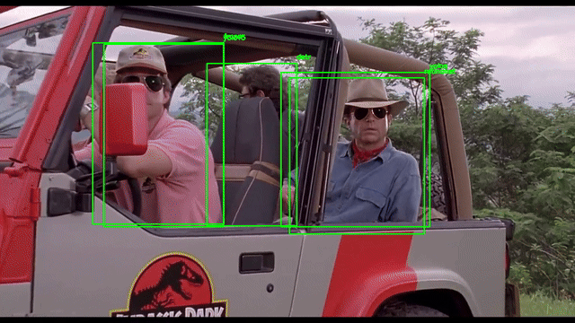

# 🔍 Compare
An Ensemble Approach to Reliable Low Latency Object Detection

[](https://opensource.org/licenses/MIT)
[](https://github.com/headertag/compare/actions/workflows/pytest.yml)

**Compare** is a sophisticated, real-time object detection system designed for high-accuracy monitoring. It leverages an ensemble of five distinct, state-of-the-art object detection models, running in parallel, to create a highly reliable and nuanced alert system. This project is the result of extensive research concluding that a multi-model ensemble is the most effective strategy to minimize false positives and create a robust detection signal, especially in challenging conditions.



The core philosophy is that by combining the outputs of diverse models—each with its own training data, biases, and architectural nuances—we can overcome the limitations of any single model and achieve a more holistic and trustworthy understanding of the visual data.

## ✨ Key Features

-   **Ensemble of Five Models**: Utilizes DETR, YOLOS, Faster R-CNN, RetinaNet, and YOLOv5 simultaneously to analyze a video stream.
-   **High-Accuracy Person Detection**: The ensemble approach significantly reduces false positives and negatives, providing reliable alerts.
-   **Real-time Telegram Alerts**: Receive instant image alerts in your Telegram chat when a person is detected with high confidence.
-   **Highly Configurable**: Easily adjust model confidence thresholds, alert sensitivity, camera settings, and more.
-   **Efficient & Modern Codebase**: A modular, thread-safe architecture with dedicated camera capture thread for optimal performance.
-   **CPU & GPU Support**: Automatically detects and uses a CUDA-enabled GPU, with a seamless fallback to CPU if not available.
-   **Web Dashboard**: A simple web interface to view the live camera feed with bounding boxes.

## ⚡ Performance and Low Latency

This system is designed for low-latency performance. The architecture employs a dedicated camera reader thread that continuously captures frames into a queue, decoupling camera I/O from model inference. The five object detection models run in parallel threads with proper memory management (`torch.no_grad()` contexts) to minimize GPU memory usage and maximize throughput.

For the lowest possible latency and highest throughput, **a CUDA-enabled GPU is highly recommended**. The models will automatically run on the GPU if one is detected, significantly accelerating the inference process. The frame queue ensures that slow inference doesn't create a backlog—old frames are automatically dropped to keep processing real-time.

## 🔧 How It Works

1.  **Camera Thread**: A dedicated background thread continuously reads frames from the camera and places them in a queue (maxsize=1), automatically discarding old frames to prevent buffering lag.
2.  **Frame Retrieval**: The main processing loop retrieves the latest frame from the queue without blocking.
3.  **Parallel Inference**: The frame is passed in-memory to all five models, which run in parallel threads for maximum efficiency. Each model runs within a `torch.no_grad()` context to prevent gradient accumulation and optimize GPU memory usage.
4.  **Thread-Safe Aggregation**: Each model returns a confidence score for the presence of a person. These scores are collected using thread-safe locks and aggregated.
5.  **Thresholding**: If the combined score surpasses a user-defined sensitivity threshold, an alert is triggered.
6.  **Alerting**: An image of the event, with bounding boxes from the models, is saved and sent to your specified Telegram chats via daemon threads.

## 📂 Project Structure

The project follows a modular and maintainable structure:

```
/
├── main.py             # Main application entry point with queue-based frame processing
├── view.py             # Ultra-lightweight local desktop screen monitor viewer
├── streamer.py         # Low-latency HTTP MJPEG streamer and shared memory frame broadcaster
├── dashboard.py        # Web dashboard for live feed
├── dashboard_main.py   # Detection loop for web dashboard streaming
├── config.py           # Configuration loading and management
├── camera.py           # Camera initialization and dedicated reader thread
├── model_loader.py     # Model loading and inference logic with thread-safe operations
├── alerts.py           # Telegram alerting functionality
├── tests/              # Unit and integration tests
├── config.yaml         # Your local configuration
├── config.yaml.example # Example configuration
├── requirements.txt    # Project dependencies
├── camera-alert.service# systemd service template for background execution
```

## 🚀 Setup

### 1. Clone the Repository

```bash
git clone https://github.com/headertag/compare.git
cd compare
```

### 2. Create a Virtual Environment (Recommended)

```bash
python3 -m venv venv
source venv/bin/activate
```

### 3. Install Dependencies

```bash
pip install -r requirements.txt
```

**Note on Dependencies**: This project requires several deep learning and computer vision libraries. The `requirements.txt` file includes specific versions and additional libraries like `timm`, `ultralytics`, `pandas`, and `seaborn` that were added to support all the models. We also constrain `numpy` to a version below `2.0` to avoid compatibility issues.

### 4. Configure the Application

Copy the example configuration file:

```bash
cp config.yaml.example config.yaml
```

Now, edit `config.yaml` with your settings:

-   **`telegram.token`**: Your Telegram bot token.
-   **`telegram.chat_ids`**: A list of chat IDs to send alerts to.
-   **`processing.device`**: Set to `"cuda"` if you have a compatible GPU, otherwise `"cpu"` (default).
-   **`camera.index`**: Index of your camera (e.g. `0` or `1`). See [CAMERA_TROUBLESHOOTING.md](CAMERA_TROUBLESHOOTING.md) for USB/HDMI capture setup and diagnosis (`python test_camera.py`).
-   Adjust other settings like `camera` and `alerting` thresholds as needed.

## 🏃 Usage

### 1. Running the System
To start the main application manually (or let `camera-alert.service` run it automatically in the background):

```bash
python main.py
```

### 2. Live Monitor Preview (Local Desktop & Remote)

The system automatically pushes processed frames with candidate bounding boxes and detection metrics to a shared-memory buffer (`/dev/shm/preview.jpg`) and a built-in low-latency HTTP streaming server.

#### A. Local Screen Viewer (`view.py`)
To monitor the live video feed directly on your Ubuntu desktop screen with minimal memory footprint (~20MB RAM, zero browser overhead):

```bash
python view.py
```

- **Fullscreen Mode:** `python view.py --fullscreen`
- **Key Controls:** Press `f` to toggle fullscreen, `q` or `ESC` to exit.
- *Note:* When launched from a Terminal window within the Ubuntu desktop session, `DISPLAY=:0` is **not required**. (If running remotely via SSH into the physical display, prefix with `DISPLAY=:0 python view.py`).

#### B. Remote Web Browser Stream
To monitor the live feed from a laptop, phone, or tablet on the same local network:

- **Live Stream:** Open `http://<jetson-ip>:8080/` in any browser.
- **Direct Snapshot:** `http://<jetson-ip>:8080/preview.jpg`

### 3. Web Dashboard (Alternative)

To run the legacy web dashboard with background segmentation:

```bash
python dashboard.py
```
Then open your browser to `http://0.0.0.0:8080`.

## 🧪 Testing

A `tests/` directory has been set up with `pytest`. You can run the tests with:

```bash
python -m pytest
```

## 🤖 Running on NVIDIA Jetson Orin Nano with Samsung Pro microSD

*Tip: If you even run into odd "L4T Recovery" errors, you need to go into the bios device manager, NVIDIA Configuration for L4T and set the OS chain A status back to Normal. This could indicate that something is wrong with your microSD but it will help unblock replacing with a new one.*

This solution has been tested with the JetPack Version: 7.2-b184 from [jetsoninstaller-r39.2.1-2026-08-07-18-30-47-arm64.iso](https://developer.nvidia.com/embedded/jetpack-sdk-62](https://drive.google.com/file/d/11-7aLMOGc64CafCbief7W18GNnfIgFuS/view?usp=sharing) then you can create the bootable installer using the ISO with the [balenaEtcher](https://etcher.balena.io/#download-etcher) application. This ISO will handle any firmware upgrades needed.

## Running as a Background Service

For continuous operation (restarting on crash and starting on boot), use the included systemd service file (`camera-alert.service`).

1. **Update Paths:** Edit `camera-alert.service` to match your environment. You will need to update `User`, `WorkingDirectory`, and the paths in `ExecStart` (ensure `ExecStart` points to the `python` binary inside your virtual environment).
2. **Install Service:** Copy the file to the systemd directory:
   ```bash
   sudo cp camera-alert.service /etc/systemd/system/
   ```
3. **Enable and Start:**
   ```bash
   sudo systemctl daemon-reload
   sudo systemctl enable camera-alert.service
   sudo systemctl start camera-alert.service
   ```
4. **Manage the Service:**
   - **View Logs Live:** `sudo journalctl -u camera-alert.service -f`
   - **Check Status:** `sudo systemctl status camera-alert.service`
   - **Restart:** `sudo systemctl restart camera-alert.service`
   - **Stop:** `sudo systemctl stop camera-alert.service`


*This project demonstrates the power of ensemble learning in practical, real-world applications. By moving beyond single-model solutions, we unlock a new level of reliability and performance.*

## EXPERIMENTAL/UNSTABLE - Install the container tools

```
git clone https://github.com/dusty-nv/jetson-containers
bash jetson-containers/install.sh

# automatically pull & run any container
jetson-containers run $(autotag l4t-pytorch)
```

Then checkout the repository and complete the earlier steps while within the containerized environment. If you have trouble installing from requirements.txt you can try doing things manually with:

```
apt remove python3-blinker
pip install --index-url https://pypi.org/simple "numpy<2.0" --force-reinstall
pip install --index-url https://pypi.org/simple transformers imutils opencv-python Pillow imutils telepot scikit-image imagehash timm ultralytics pandas seaborn "numpy<2.0" flask pytest
```
